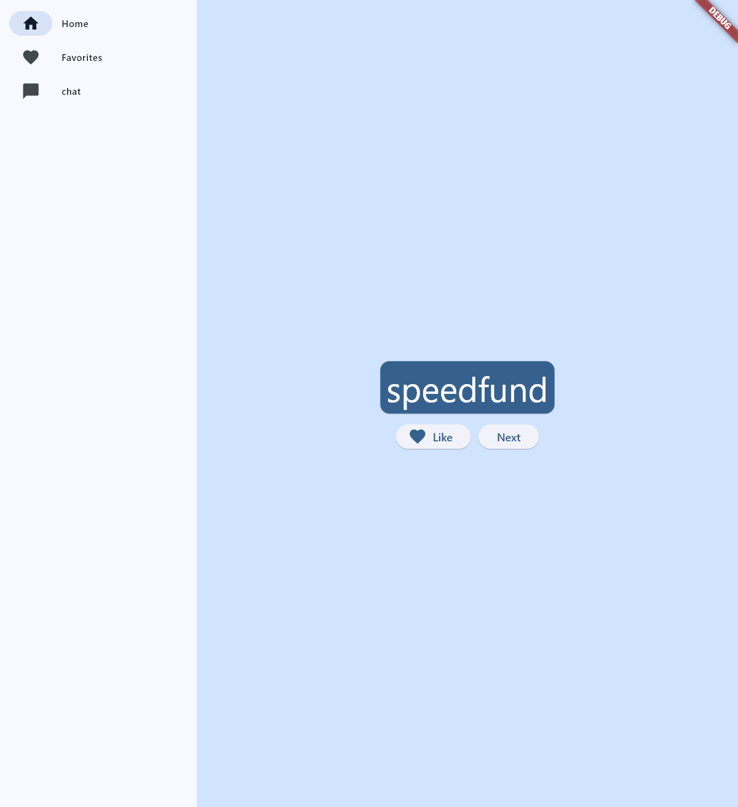
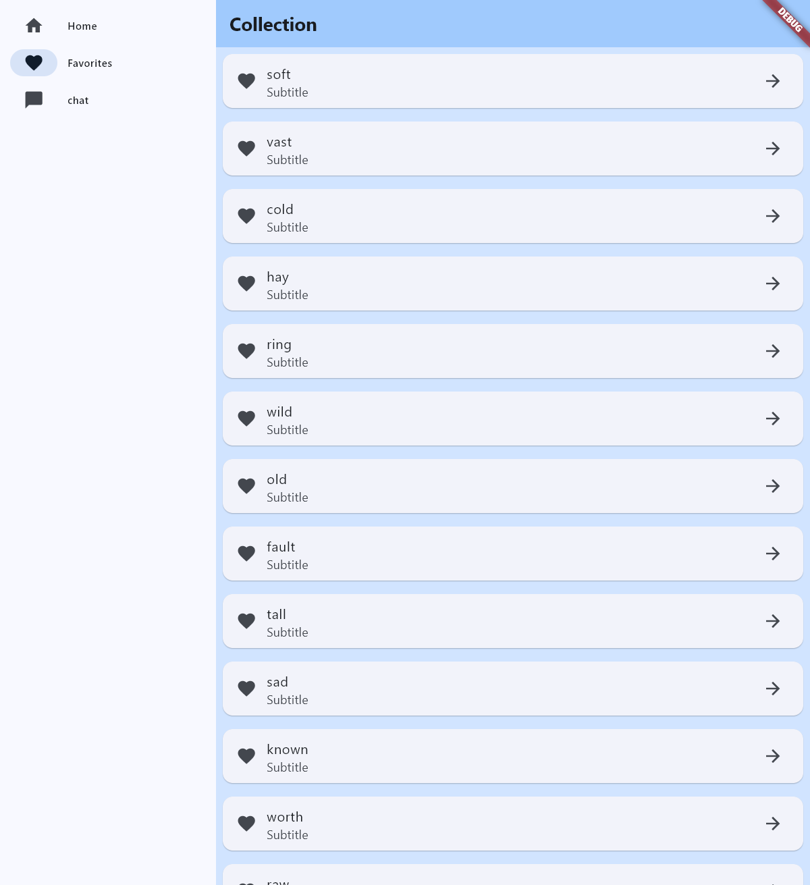

### ROAD MAP

- [x] ~~主页面设置~~

- [x] ~~添加收藏列表~~
- [x] ~~接入大语言模型（已经接入DeepSeek Chat）~~
- [ ] 多词库功能
- [ ] 更改主题颜色

- [ ] 收藏列表优化
  - [ ] 限定可收藏单词数量上限
- [ ] API Key 的管理策略

- [ ] Prompt Engineering
  - [ ] 性格设定（督促单词记忆型）
  - [ ] 对话内容设定






### 环境搭建

##### Software requirements

- VSCode
- gradle
- Android tool chain
  - [x] **Android SDK Platform, API 34.0.5**
  - [x] **Android SDK Command-line Tools**
  - [x] **Android SDK Build-Tools**
  - [x] **Android SDK Platform-Tools**
  - [x] **Android Emulator**

##### Internet requirements

- Gradle Proxy (Dir: gradle.properties)

  ```properties
  org.gradle.jvmargs=-Xmx4G -XX:+HeapDumpOnOutOfMemoryError
  android.useAndroidX=true
  android.enableJetifier=true
  systemProp.http.proxyHost=127.0.0.1
  systemProp.https.proxyHost=127.0.0.1
  systemProp.https.proxyPort=7890
  systemProp.http.proxyPort=7890
  ```

- Git Proxy

  ```git
  git config --global http.proxy http://127.0.0.1:7890
  git config --global https.proxy http://127.0.0.1:7890
  ```

  
